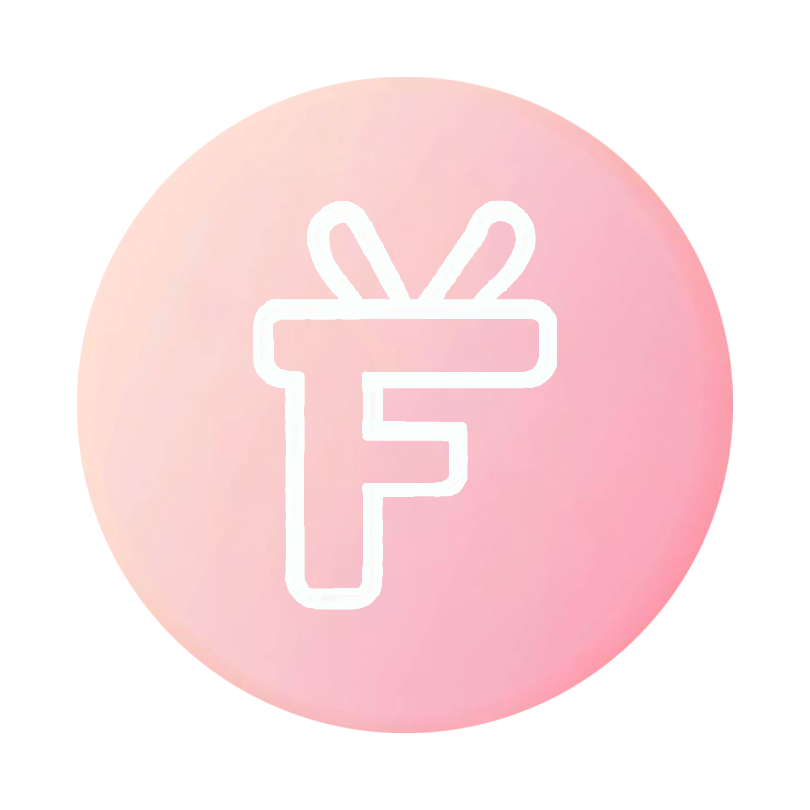

# FunSun: 즐거운 원윤선 플랫폼

FunSun은 상대방의 취향과 필요성을 고려하여 정말 받고싶은 선물을 받을 수 있도록 친구들이 함께 서포트하는 플랫폼입니다. 크라우드 펀딩의 개념을 도입하여 여러 사용자들이 함께 모여 선물을 구매하고 불필요한 비용을 줄이는 서비스를 제공합니다.

## 주요 기능

- **로그인 페이지**: 카카오 로그인을 지원하며, 로그인 정보가 있는 경우 하단바 페이지로 자동 이동됩니다.

- **하단바 페이지**: 홈, 탐색, 마이페이지로 구성된 핵심 페이지에 쉽게 접근할 수 있습니다.

- **홈**: 서비스에 대한 소개와 함께 펀딩 생성 및 친구들의 펀딩을 확인할 수 있습니다.

- **탐색**: 유저 검색, 전체 공개 펀딩, 내가 서포트한 펀딩을 확인할 수 있습니다. 검색 기록과 검색 결과를 제공합니다.

- **마이페이지**: 회원 정보 수정, 팔로워/팔로잉 목록, 펀딩 생성, 내 펀딩 목록, 서포트한 펀딩 목록, FAQ, 로그아웃, 회원 탈퇴 등을 포함한 다양한 기능을 제공합니다.

- **유저 페이지**: 각 유저의 프로필 페이지로 이동하여 팔로우/언팔로우 하거나 해당 유저의 펀딩을 확인할 수 있습니다.

- **펀딩 페이지**: 펀딩 게시글의 친구 공개 여부, 달성률, 남은 펀딩 기간을 확인하고 서포트 메시지를 남길 수 있습니다. 펀딩 작성자는 펀딩 후기를 작성할 수 있습니다.

- **펀딩 생성 페이지**: 펀딩 제목, 펀딩 설명, 펀딩 목표 금액, 펀딩 기간, 펀딩 공개 여부, 펀딩 이미지를 업로드하여 펀딩을 생성할 수 있습니다.

- **펀딩 서포트 페이지**: 펀딩에 서포트할 금액을 입력하고 서포트 메시지를 남길 수 있습니다. 이 부분이 펀딩 페이지에서 댓글 기능을 대체합니다. 서포트를 진행해야 축하메세지(댓글)를 남길 수 있습니다.
  카카오페이 API를 이용하여 펀딩 서포트를 진행합니다.

## 사용 기술

- **Frontend**: Flutter, Kakao Login API, Kakao Pay API, Provider

- **Backend**: Django, Oracle Cloud, JWT, Kakao Login API, Kakao Pay API,

- **Database**: AWS RDS -> Oracle Cloud

- **Version Control**: Git, Github

- **Communication**: 카카오톡, 전화, 대면, 동거, 손편지, 인스타그램 스토리 언급

- **IDE**: Visual Studio Code

- **Design**: Figma

# 팀원 소개

## 최윤호 - 팀장

- 학년: 2학년
- 프론트엔드
- 특이사항: 흡연장에서 비눗방울을 붑니다. 에러 발생 시 달려가 해결하는 모습이 말벌 아저씨 같습니다.

## 박상규

- 학년: 2학년
- 백엔드
- 특이사항: 백엔드를 혼자 처치하고 프론트까지 넘어온 괴물입니다. 모든 기업이 박상규를 원합니다. 더 이상의 설명은 생략합니다.

## 이정현

- 학년: 1학년
- 프론트엔드
- 특이사항: 담배를 맛있게 피기 위한 기능사를 취득한 1학년 에이스입니다. 박상규와 함께 있을 때의 시너지와 광기는 정말 무섭습니다. 집과 일터의 구분이 없어 보입니다.

## 원윤선

- 학년: 1학년
- 프론트엔드, 디자인
- 특이사항: 현 가라르지방 챔피언으로서 상당한 실력을 가진 굥선입니다. 구린 레이아웃을 견딜 수 없어서 매번 깃을 롤백합니다. 미모와 지성을 겸비하고 있습니다. 단, 본인은 모른다고 합니다.
